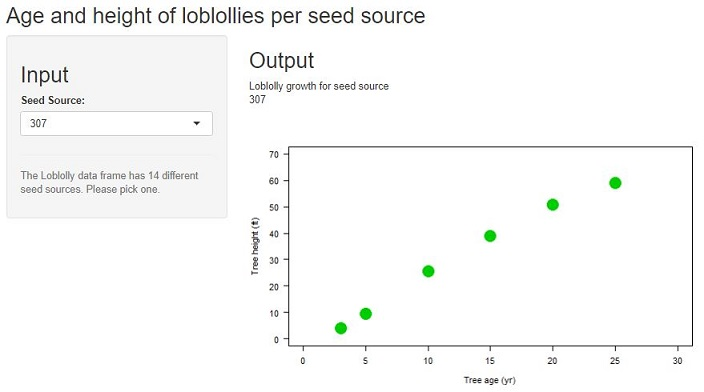

## Growth of Loblolly pine trees
<center></center>
<span style="color:forestgreen">
<font size="4">
Pinus taeda, commonly known as loblolly pine, is one of several pines native to the Southeastern United States, see [wikipedia](https://en.wikipedia.org/wiki/Pinus_taeda) for more information.
</span>
</font>

<span style="color:forestgreen">
<font size="4">
The R dataset contains the Loblolly data frame whith 84 rows and 3 columns of records of the growth of Loblolly pine trees.
Based on this dataset a shiny app helps to view the data. The user selects a seed source. As a default the minimal seed source is selected.
The [shiny app](https://hn317.shinyapps.io/ShinyLoblolly/) returns a plot with the growth of Loblolly tress for the selected seed source.
</span>
</font>


## ui.R
```{r, eval=FALSE}
library(shiny)
shinyUI(fluidPage(
  titlePanel("Age and height of loblollies per seed source"),
  sidebarLayout(
    sidebarPanel(
      h2("Input"),
      selectInput("seedsource", "Seed Source:", 
                  choices=sort(levels(Loblolly$Seed)), multiple=FALSE),
      hr(),
      helpText("The Loblolly data frame has 14 different seed sources. Please pick one.")
      ),
    mainPanel(
      h2("Output"),
      "Loblolly growth for seed source " , textOutput("text"),
      plotOutput("LoblollyPlot") 
      )
  )
))
```

## server.R
```{r, eval=FALSE}
library(shiny)
shinyServer(function(input, output) {
  output$text <- renderText(input$seedsource)
  output$LoblollyPlot <- renderPlot({ 
    plot(height ~ age, data = Loblolly, subset = Seed == input$seedsource,
               col = input$seedsource, 
               pch = 20, 
               cex = 5,
               xlab = "Tree age (yr)", las = 1,
               ylab = "Tree height (ft)",
               xlim = c(0,30),
               ylim = c(0,70)
         )
})
})
```

## Result


<span style="color:forestgreen">
<font size="4">
Shiny App and presentation were done for the course "Developing Data Products" from Johns Hopkins on Coursera.
</span>
</font>